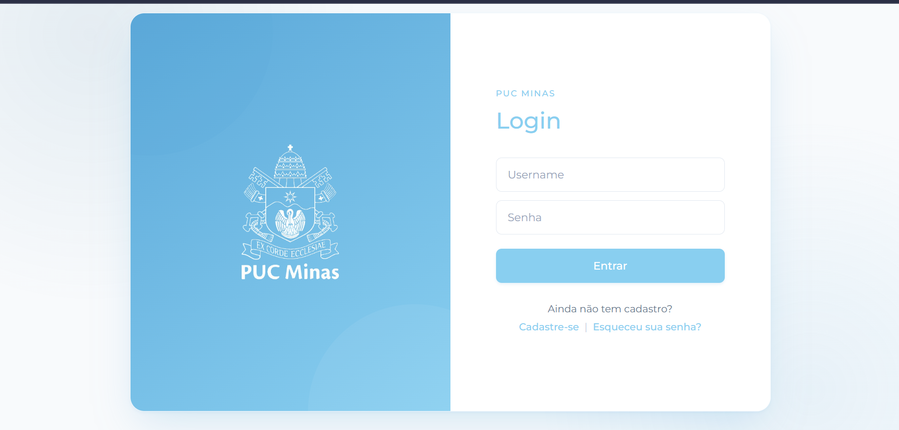
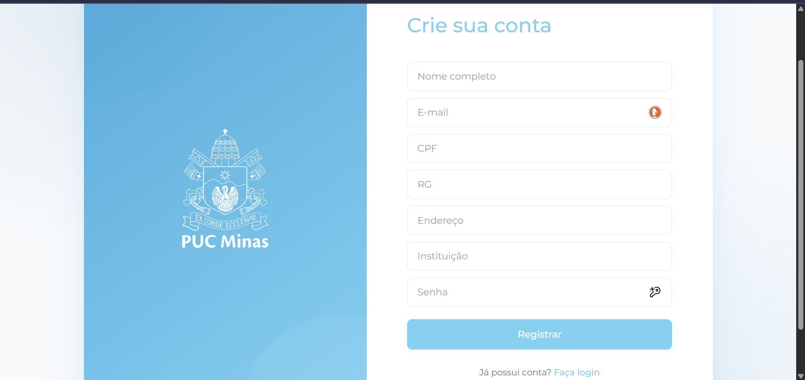
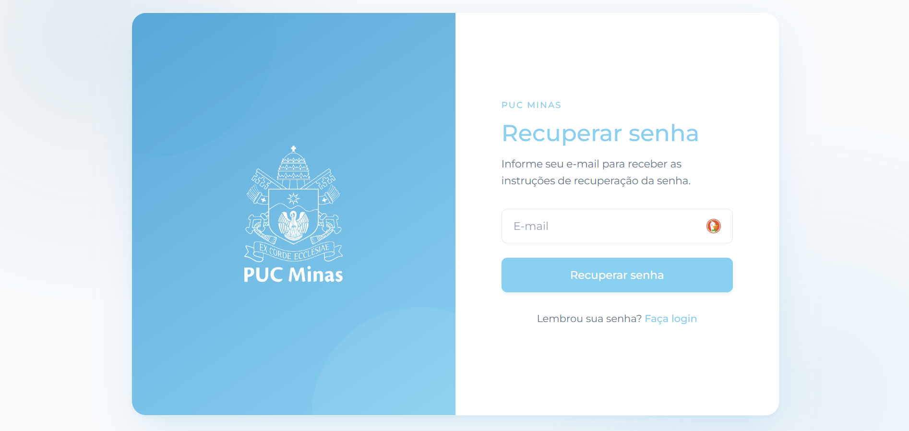
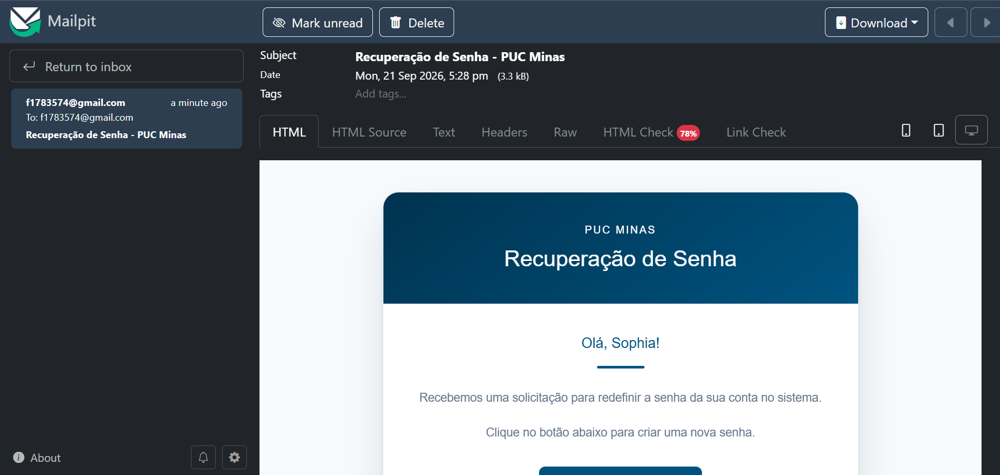

# Projeto AcessoPUC

## Descrição

O AcessoPUC é um projeto de estudo que simula o fluxo de **login, cadastro e recuperação de senha** do sistema da PUC Minas. A aplicação foi desenvolvida em **Java com Spring Boot**, tomando como base o projeto de referência [SecureLoginPUC_3](https://github.com/joaopauloaramuni/desenvolvimento-e-integracao-de-aplicacoes-web/tree/main/PROJETOS/SpringBoot/SecureLoginPUC_3) e acrescentando:

- uma **API REST** (`/api/users`) para administração de usuários;
- **recuperação de senha por e-mail** de verdade, usando o Spring Mail (`JavaMailSender`);
- **perfil de teste local** para validar o envio de e-mails sem usar um e-mail real.

O objetivo é autenticar usuários diferenciando **usuários comuns** de **administradores**, garantindo o acesso apropriado às páginas da aplicação.

## Estrutura do Projeto

```text
📁 AcessoPUC
│
├── 📁 src
│   │
│   ├── 📁 main
│   │   │
│   │   ├── ☕ java
│   │   │   └── 📦 com.projeto.acessopuc
│   │   │       │
│   │   │       ├── 🚀 AcessopucApplication.java
│   │   │       │   └── Classe principal da aplicação Spring Boot
│   │   │       │
│   │   │       ├── 🔐 config
│   │   │       │   ├── SecurityConfig.java
│   │   │       │   │   └── Configurações do Spring Security
│   │   │       │   │
│   │   │       │   └── UserConfig.java
│   │   │       │       └── Configuração dos usuários (application.properties)
│   │   │       │
│   │   │       ├── 🎮 controller
│   │   │       │   ├── AcessoController.java
│   │   │       │   │   └── Páginas e fluxos de login, cadastro e recuperação de senha
│   │   │       │   │
│   │   │       │   └── ApiUserController.java
│   │   │       │       └── API REST `/api/users`
│   │   │       │
│   │   │       ├── ⚠️ exception
│   │   │       │   ├── GlobalExceptionHandler.java
│   │   │       │   │   └── Tratamento global de exceções
│   │   │       │   │
│   │   │       │   └── SendEmailException.java
│   │   │       │       └── Exceção relacionada ao envio de e-mails
│   │   │       │
│   │   │       ├── 📦 model
│   │   │       │   └── Usuario.java
│   │   │       │       └── Representação do usuário da API REST
│   │   │       │
│   │   │       └── ⚙️ service
│   │   │           ├── UserService.java
│   │   │           │   └── Gerenciamento dos usuários (Spring Security em memória)
│   │   │           │
│   │   │           ├── ApiUserService.java
│   │   │           │   └── Lógica da API REST de usuários
│   │   │           │
│   │   │           ├── SendEmailService.java
│   │   │           │   └── Serviço responsável pelo envio de e-mails
│   │   │           │
│   │   │           └── PasswordRecoveryService.java
│   │   │               └── Geração e validação de tokens de recuperação
│   │   │
│   │   └── 📁 resources
│   │       │
│   │       ├── ⚙️ application.properties
│   │       │   └── Configurações da aplicação, usuários e e-mail (SMTP Gmail)
│   │       │
│   │       ├── ⚙️ application-teste.properties
│   │       │   └── Perfil de teste: SMTP local (Mailpit) sem envio real
│   │       │
│   │       ├── 🎨 static
│   │       │   ├── 🎨 css
│   │       │   │   ├── admin.css
│   │       │   │   ├── error.css
│   │       │   │   ├── home.css
│   │       │   │   ├── login.css
│   │       │   │   ├── recoverpassword.css
│   │       │   │   ├── register.css
│   │       │   │   └── resetpassword.css
│   │       │   │       └── Arquivos de estilização das páginas
│   │       │   │
│   │       │   └── 🖼️ images
│   │       │       ├── pucminas-logo.png
│   │       │       │   └── Logo utilizado pela aplicação
│   │       │       ├── login.png
│   │       │       ├── cadastro.png
│   │       │       ├── recuperar.png
│   │       │       └── email.png
│   │       │           └── Capturas de tela das páginas (usadas no README)
│   │       │
│   │       └── 🌐 templates
│   │           ├── admin.html
│   │           │   └── Página da área administrativa
│   │           │
│   │           ├── error.html
│   │           │   └── Página apresentada quando ocorre um erro
│   │           │
│   │           ├── home.html
│   │           │   └── Página inicial após autenticação
│   │           │
│   │           ├── login.html
│   │           │   └── Página de login
│   │           │
│   │           ├── recoverpassword.html
│   │           │   └── Página de recuperação de senha
│   │           │
│   │           ├── resetpassword.html
│   │           │   └── Página para redefinição da senha
│   │           │
│   │           └── register.html
│   │               └── Página de cadastro de usuários
│   │
│   └── 📁 test
│       └── ☕ java
│           └── AcessopucApplicationTests.java
│               └── Teste de contexto da aplicação
│
└── 📄 pom.xml
    └── Dependências e configurações do Maven
```

## Configuração do application.properties

```properties
spring.application.name=acessopuc

app.user.username=seuemail@gmail.com
app.user.password=sua-senha
app.user.name=Sophia

app.admin.username=profaramuni
app.admin.password=profaramuni
app.admin.name=Administrador

server.port=8080

# =========================================================
# EMAIL (GMAIL SMTP)
# =========================================================
spring.mail.host=smtp.gmail.com
spring.mail.port=587
spring.mail.username=seuemail@gmail.com
# https://myaccount.google.com/apppasswords
# sua senha de app aqui (É necessário ativar a autenticação de dois fatores antes no Gmail)
spring.mail.password=SUA_SENHA_DE_APP_AQUI
spring.mail.properties.mail.smtp.auth=true
spring.mail.properties.mail.smtp.starttls.enable=true
spring.mail.properties.mail.smtp.starttls.required=true
```

### Perfil de teste (opcional, sem enviar e-mail real)

O arquivo `application-teste.properties` aponta o envio para um **servidor SMTP local (Mailpit)**, que aceita qualquer mensagem e mostra o e-mail recebido em `http://localhost:8025` — sem precisar de credenciais e sem enviar nada para fora da máquina.

```properties
spring.mail.host=localhost
spring.mail.port=1025
spring.mail.properties.mail.smtp.auth=false
spring.mail.properties.mail.smtp.starttls.enable=false
spring.mail.properties.mail.smtp.starttls.required=false
```

## Dependências

```xml
<!-- Dependência do Spring Security -->
<dependency>
    <groupId>org.springframework.boot</groupId>
    <artifactId>spring-boot-starter-security</artifactId>
</dependency>

<!-- Dependência do Thymeleaf para o Spring Boot -->
<dependency>
    <groupId>org.springframework.boot</groupId>
    <artifactId>spring-boot-starter-thymeleaf</artifactId>
</dependency>

<!-- Dependência do Spring MVC -->
<dependency>
    <groupId>org.springframework.boot</groupId>
    <artifactId>spring-boot-starter-webmvc</artifactId>
</dependency>

<!-- Extras do Thymeleaf para o Spring Security -->
<dependency>
    <groupId>org.thymeleaf.extras</groupId>
    <artifactId>thymeleaf-extras-springsecurity6</artifactId>
</dependency>

<!-- Dependência do Spring Mail para o envio de email -->
<dependency>
    <groupId>org.springframework.boot</groupId>
    <artifactId>spring-boot-starter-mail</artifactId>
</dependency>
```

# Thymeleaf

Thymeleaf é um motor de templates para Java que permite a criação de páginas HTML dinâmicas de forma simples e eficiente. Ele é frequentemente utilizado em aplicações Spring, proporcionando uma maneira intuitiva de gerar conteúdo HTML e manipular dados diretamente nas páginas.

## Principais Características

- **Natural Templating**: Os templates Thymeleaf são válidos como documentos HTML, permitindo que sejam visualizados em navegadores sem processamento.
- **Integração com Spring**: Thymeleaf se integra perfeitamente com o Spring Framework, facilitando a injeção de dependências e o acesso a beans do Spring.
- **Expressões de Template**: Utiliza uma sintaxe simples e expressiva para manipular dados, permitindo a criação de lógicas condicionais e loops diretamente nas páginas.

## Exemplo de Uso

Aqui está um exemplo simples de um template Thymeleaf:

```html
<!DOCTYPE html>
<html xmlns:th="http://www.thymeleaf.org">
<head>
    <title>Exemplo Thymeleaf</title>
</head>
<body>
    <h1 th:text="${titulo}">Título do Documento</h1>
    <ul>
        <li th:each="item : ${itens}" th:text="${item}"></li>
    </ul>
</body>
</html>
```

Neste exemplo, o título e a lista de itens são preenchidos dinamicamente com dados fornecidos pelo controlador Spring.

# Interface Gráfica

A interface gráfica permite ao usuário inserir seus dados de login e, após a autenticação, ser redirecionado para a página correspondente, onde terá acesso às funcionalidades e informações de acordo com suas credenciais.

- **Login**: A página de login possui campos para inserir o nome de usuário e a senha. Ela também exibe o logo da PUC Minas, proporcionando uma identificação visual clara da instituição. Abaixo do formulário de login, existem links para os usuários que ainda não possuem cadastro, direcionando-os para a página de registro, e para aqueles que esqueceram a senha, levando-os à página de recuperação de senha.

- **Register**: A página de registro permite que novos usuários criem uma conta na plataforma. Ela inclui campos para inserir **nome completo, e-mail, CPF, RG, endereço, instituição e senha**, garantindo que todas as informações necessárias para cadastro sejam coletadas. O cadastro cria o usuário em memória no Spring Security, permitindo que ele faça login em seguida.

- **Recover Password**: A página de recuperação de senha solicita o e-mail cadastrado. Ao enviar, a aplicação gera um **token válido por 15 minutos** e envia um e-mail (HTML) com um link para a página de redefinição de senha.

- **Reset Password**: A página de redefinição de senha exige a nova senha e sua confirmação. Ao concluir, a senha é atualizada em memória e o token de recuperação é invalidado.









# Como testar o envio de e-mail

### Com e-mail real (Gmail)

1. Ative a **verificação em 2 etapas** na sua conta do Google.
2. Gere uma **senha de app** em: `https://myaccount.google.com/apppasswords`.
3. Preencha `spring.mail.username` com o seu e-mail e `spring.mail.password` com a senha de app gerada.
4. Inicie a aplicação e acesse `/recoverpassword` para testar.

### Sem enviar e-mail real (Mailpit)

Prático para validar o fluxo inteiro localmente, sem credenciais.

1. Baixe o binário do [Mailpit](https://github.com/axllent/mailpit/releases) (Windows: `mailpit-windows-amd64.zip`) e extraia em uma pasta de sua preferência.
2. Execute o binário (SMTP fica em `localhost:1025`; interface web em `http://localhost:8025`) — ajuste o caminho abaixo para a pasta onde você o extraiu:

```powershell
& "C:\caminho\para\mailpit.exe"
```

3. Inicie a aplicação com o perfil de teste. No Windows, use o argumento entre aspas (ou a variável de ambiente):

```powershell
mvnw spring-boot:run "-Dspring-boot.run.profiles=teste"
# ou:
$env:SPRING_PROFILES_ACTIVE='teste'; mvnw spring-boot:run
```

4. Cadastre um usuário em `/register` **com um e-mail válido** (ex.: `sophia.ferreira@exemplo.com`) e solicite a recuperação em `/recoverpassword` com o mesmo e-mail.

> **Importante:** o SMTP só aceita destinatários com formato de e-mail válido (com domínio). O usuário informado em `/recoverpassword` deve estar **cadastrado** e ser um e-mail válido — do contrário, o envio falha com erro `553 Invalid Address` (ou a página informa "E-mail não encontrado"). Para facilitar, o usuário padrão já é um e-mail: `f1783574@gmail.com` (`app.user.username` no `application.properties`).

5. Abra `http://localhost:8025`, clique no e-mail recebido e no botão **"Redefinir minha senha"** para concluir o fluxo.

# Métodos da Classe SecurityConfig

### @Configuration
Indica que a classe contém métodos de configuração que geram beans para o contexto da aplicação.

### @EnableWebSecurity
Ativa a segurança da web, permitindo a configuração de regras de segurança para as URLs da aplicação.

### public SecurityFilterChain securityFilterChain(HttpSecurity http) throws Exception
Configura as regras de segurança das requisições HTTP, permitindo o acesso público às páginas de login, cadastro e recuperação de senha e aos arquivos CSS, restringindo o acesso às páginas do administrador.

### public InMemoryUserDetailsManager userDetailService()
Configura o gerenciamento de usuários em memória, criando um usuário comum e um administrador, codificando as senhas.

### public PasswordEncoder passwordEncoder()
Define o codificador de senhas a ser utilizado na aplicação, utilizando o BCryptPasswordEncoder.

## Urls do projeto:
http://localhost:8080/login

http://localhost:8080/login?logout=true

http://localhost:8080/home

http://localhost:8080/admin

http://localhost:8080/error

http://localhost:8080/register

http://localhost:8080/recoverpassword

http://localhost:8080/resetpassword

http://localhost:8080/api/users

## Licença
Este projeto está licenciado sob a MIT License.